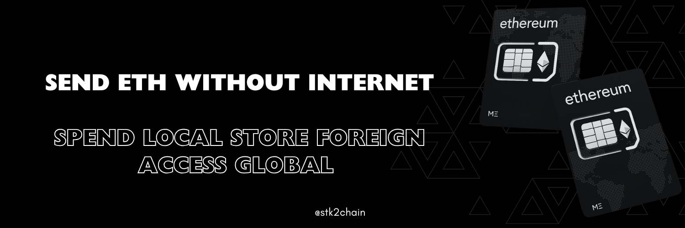

# Mobile ETH Specifications

<!-- markdownlint-disable-next-line MD036 -->

**STK2ETH: An Account Abstraction eSIM ToolKit *(eSTK)* Wallet that Relays User Transactions over USSD. *(No internet required)*.**
<!--**STK2ETH: Send ETH *(No internet required)*.**-->

This doc specifies the STK2ETH protocol, including the USSD-ETH Gateway (short: *4337#), a USSD gateway enabling offline User Transaction relays for AA wallets.
- 

System Schematics

    

## Protocol

- [**Java Card Applet (eSTK)**](./doc/specs/applet.md) - The STK2ETH Java Card Applet.
- [**USSD-ETH Gateway (ussdgeth)**](./doc/specs/gateway.md) - The STK2ETH USSD-ETH Gateway.
- [**AA Smart Contracts**](./doc/specs/contracts.md) - The STK2ETH Account Abstraction Smart Contracts.

## eSIM Technical Specifications

- [ETSI TS 131 111 V18.6.0 (2024-07)](https://www.etsi.org/deliver/etsi_ts/131100_131199/131111/18.06.00_60/ts_131111v180600p.pdf) : 3GPP TS 31.111 (USAT/STK) - Universal Subscriber Identity Module (USIM) Application Toolkit (USAT) Technincal Specification
<!-- ETSI TS 131 111: 6 Proactive UICC -->
<!-- **6.4.12 SEND USSD -->
<!-- ***6.4.12.2 Application Mode -->
<!-- **6.5 Common elements in proactive UICC commands -->
<!-- **6.6 Structure of proactive UICC commands -->
<!-- **6.6.11 SEND USSD -->
<!-- 8.6 Command details -->
<!-- 8.17 USSD string -->

- [ETSI TS 123 038 V16.0.0 (2020-07)](https://www.etsi.org/deliver/etsi_ts/123000_123099/123038/16.00.00_60/ts_123038v160000p.pdf) : 3GPP TS 23.038  -
Alphabets and language-specific information Technical Specification
<!-- GSM 03.38: GSM 7-bit default alphabet Technical Specification -->
<!-- **6.1.2 Character packing -->
<!-- **6.1.2.3 USSD packing -->

- [ETSI TS 102 223 V17.6.0 (2025-04)](https://www.etsi.org/deliver/etsi_ts/102200_102299/102223/17.06.00_60/ts_102223v170600p.pdf) - Card Application Toolkit (CAT) Technical Specification
<!-- 4.2 Proactive UICC -->
<!-- 4.11 Bearer Independent Protocol  -->
<!-- 5.2 Structure and coding of TERMINAL PROFILE -->
<!-- 6 Proactive UICC -->
<!-- **6.4 Proactive UICC commands and procedures -->
<!-- **6.5 Common elements in proactive UICC commands -->
<!-- **6.6 Structure of proactive UICC commands -->
<!-- 9 Tag values -->
<!-- **9.2 BER-TLV tags in UICC to terminal direction -->
<!-- **9.3 COMPREHENSION-TLV tags in both directions -->
<!-- Annex C (normative): Structure of CAT communications -->
<!-- Annex B (informative): Example of DISPLAY TEXT proactive UICC command -->
<!-- 8.6 Command details -->

- [ETSI TS 101 220 V18.2.0 (2024-11)](https://www.etsi.org/deliver/etsi_ts/101200_101299/101220/18.02.00_60/ts_101220v180200p.pdf) - ETSI numbering system
for telecommunication application providers Technical Specification
<!-- 7 Tag-Length-Value (TLV) data objects -->
<!-- **7.1.1 COMPREHENSION-TLV tag coding -->
<!-- **7.2 Assigned TLV tag values -->
<!-- ***Table 7.17 Card application toolkit templates BER-TLV tag -->

- [ETSI TS 131 115 V18.0.0 (2024-05)](https://www.etsi.org/deliver/etsi_ts/131100_131199/131115/18.00.00_60/ts_131115v180000p.pdf) : 3GPP TS 31.115 - Secured packet structure for (Universal) Subscriber Identity Module (U)SIM Toolkit applications Technical Specification
<!-- 6 Implementation for USSD -->
<!-- Annex A (normative): USSD String format -->
<!-- **6.1 Structure of the Command Packet contained in a Single
USSD Message -->
<!-- **6.2 Structure of the Command Packet contained in concatenated USSD Messages -->

<!--- [ETSI TS 131 102 V18.6.2 (2024-11)](https://www.etsi.org/deliver/etsi_ts/131100_131199/131102/18.06.02_60/ts_131102v180602p.pdf) : 3GPP TS 31.102 Characteristics of the Universal Subscriber Identity Module (USIM) application Technical Specification-->
